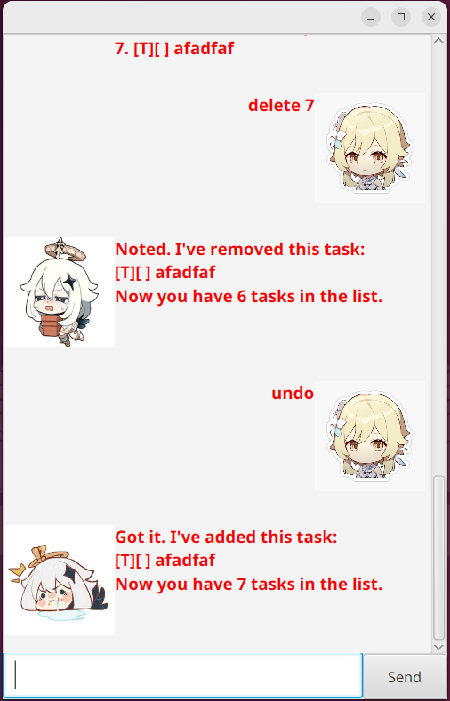

# Paimon User Guide

Paimon is a simple and intuitive task management application that helps you organize tasks, deadlines, and events efficiently.



## Available Commands

### 1. Listing Tasks
Displays all current tasks with their status.
```
list
```

### 2. Adding Tasks

- **Todo Task:**  
Adds a task with description only.
```
todo Read book
```

- **Deadline Task:**  
Adds a task with a specified deadline. Time format d/M/yyyy HHmm
```
deadline Submit report /by 2/12/2019 1800
```

- **Event Task:**  
Adds an event with a start and end time. Time format is d/M/yyyy HHmm
```
event Team meeting /from 2/12/2019 1800 /to 2/12/2019 1900
```

### 3. Marking Tasks
Marks a task as completed. list is 1-indexed.
```
mark 1
```

### 4. Unmarking Tasks
Marks a previously completed task as incomplete. List is 1-indexed.
```
unmark 1
```

### 5. Deleting Tasks
Deletes a task from your list. List is 1-indexed.
```
delete 1
```

### 6. Finding Tasks
Searches and displays tasks containing a specific keyword.
```
find book
```

### 7. Undoing Last Command
Reverses the effect of the last action performed. However, this can only be done once. For example, "undo an undo" has no effect currently.
For some commands like `list`, `undo` has no effect.
```
undo
```

### 8. Exiting Paimon
Closes the application.
```
bye
```
